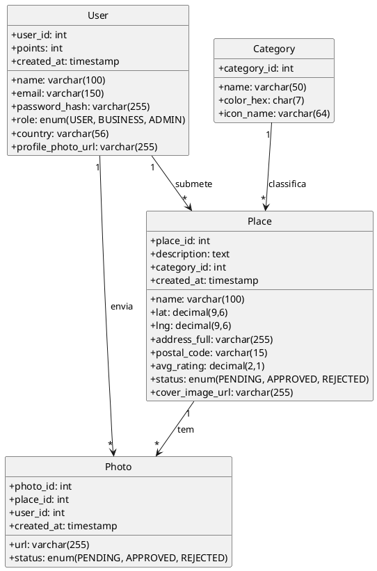
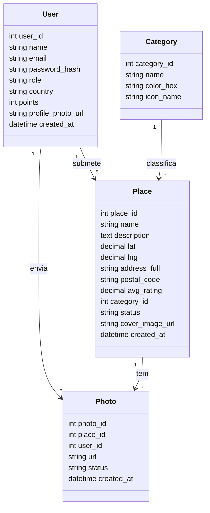
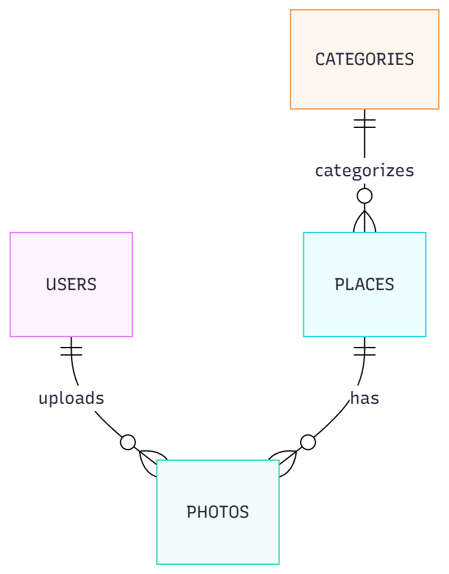
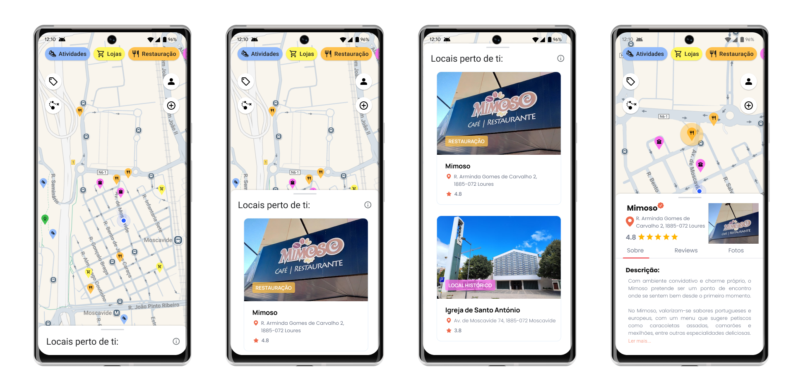
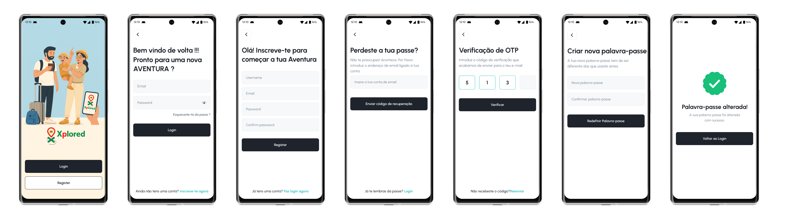
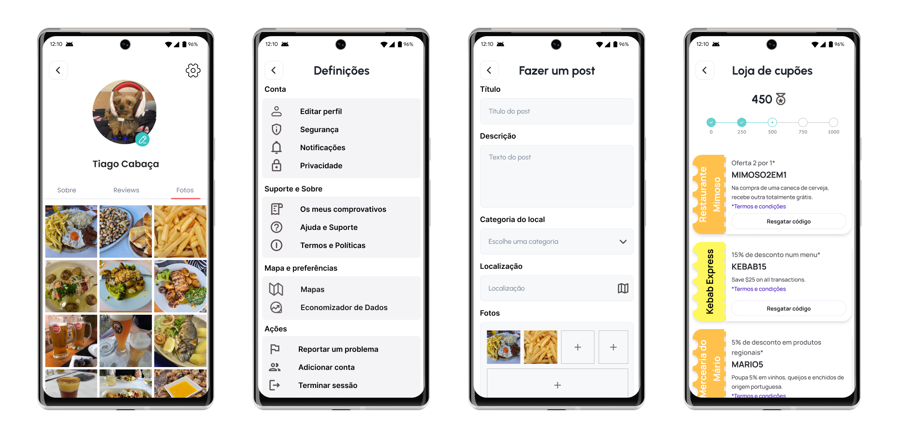
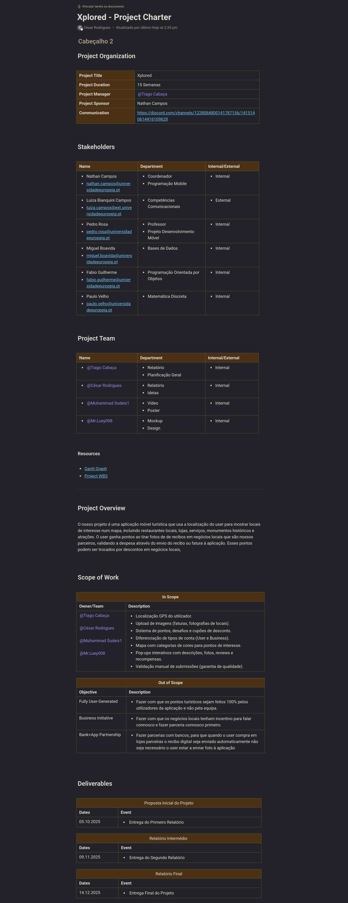
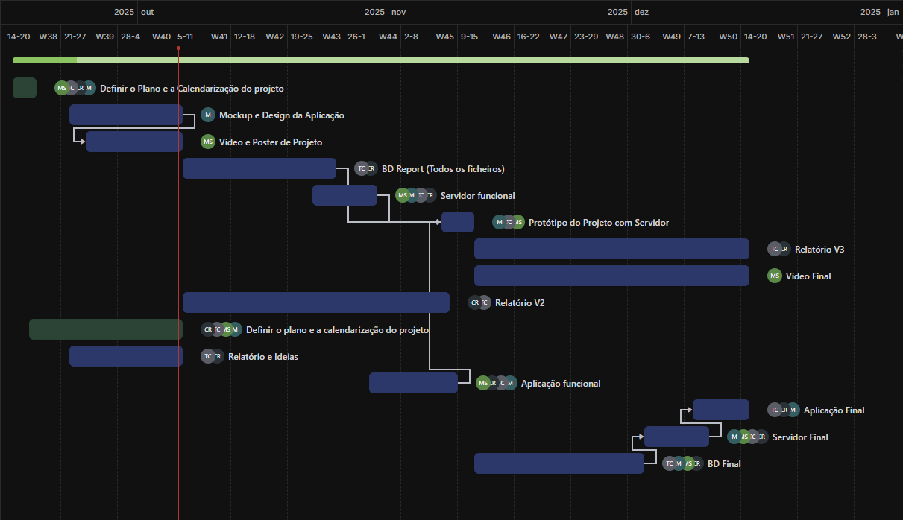

# Relatório - 2ª Entrega Projeto Mobile

## 1. Identificação

* **Universidade:** IADE - Universidade Europeia
* **Unidade Curricular:** Projeto de Desenvolvimento Móvel
* **Grupo:** t1-g01-cesar_lucas_tiago_muhammad
* **Nome do Projeto:** Xplored
* **Membros do Grupo:**

  * Tiago Manuel Antunes Cabaça - 20241185
  * César de Oliveira Rodrigues - 20240449
  * Lucas Dernedde Sequeira Gomes Nicolau - 20241526
  * Muhammad Sudeis Abdul Latif Sacoor - 20241707
* **Link GitHub:** https://github.com/Cabacadosinformaticos/Xplored.git

---

## 2. Palavras-chave

Turismo, Gamificação, Comércio Local, Exploração, Localização, Cultura, Sustentabilidade, Tecnologia, Mobile, Experiência Interativa.

---

## 3. Descrição breve da aplicação

O projeto **Xplored** é uma aplicação móvel inovadora que procura transformar a forma como turistas e residentes exploram o espaço urbano e cultural. A app apresenta um **mapa interativo** que localiza o utilizador em tempo real e mostra pontos de interesse próximos organizados por categorias distintas, cada uma com uma cor representativa (restauração, monumentos, arte urbana, natureza, etc.).

A exploração é reforçada por um **sistema de gamificação**, que atribui pontos ao utilizador conforme ele interage com os locais. Exemplos de ações que geram pontos incluem:

* Visitar locais culturais, monumentos ou zonas de natureza.
* Percorrer trajetos Pedipaper predefinidos.
* Tirar e enviar fotografias em locais indicados.
* Validar compras em estabelecimentos parceiros enviando fotos de faturas.

Os pontos acumulados podem ser trocados por **recompensas reais**, como cupões de desconto em restaurantes, lojas ou atividades culturais. A aplicação, assim, junta turismo, comércio local e tecnologia de forma única.

Outro elemento diferenciador é a possibilidade de **contas Business**: comerciantes podem registar o seu negócio, adicionar pontos turísticos e disponibilizar cupões de desconto. Esta funcionalidade gera valor tanto para utilizadores, que encontram vantagens e experiências personalizadas, como para comerciantes, que ganham visibilidade e atraem novos clientes.

O slogan provisório definido é:

> *“Explore it, Mark it, Share it”*, destacando a experiência de explorar locais, marcar memórias e partilhá-las com a comunidade.

---

## 4. Objetivos e Motivação

**Objetivos principais:**

1. Promover o turismo sustentável e de proximidade.
2. Incentivar turistas e residentes a descobrir e valorizar locais culturais, históricos, gastronómicos e de lazer.
3. Apoiar diretamente o comércio local através de parcerias e recompensas.
4. Criar um sistema de gamificação atrativo que motive o uso contínuo da aplicação.
5. Desenvolver uma plataforma digital robusta que integre mobilidade, tecnologia e interação social.

**Motivação:**

* Muitas aplicações existentes focam-se em reviews ou apenas em localização, mas poucas criam uma ligação direta entre exploração turística e recompensas tangíveis.
* O Xplored preenche esta lacuna ao unir **exploração cultural** com **benefícios práticos** para o utilizador e para os negócios.
* A aplicação reflete uma necessidade crescente por **turismo autónomo**, no qual o visitante controla o seu tempo e experiências, sem depender de grupos turísticos rígidos.
* Também responde à valorização de práticas **sustentáveis e locais**, ajudando a dinamizar pequenas empresas e reforçar a identidade cultural das cidades.

---

## 5. Público-Alvo

O Xplored tem como público-alvo vários segmentos complementares:

* **Turistas nacionais e estrangeiros** que procuram experiências autênticas, evitando roteiros demasiado turísticos.
* **Jovens e adultos** interessados em cultura, gastronomia, arte urbana e atividades de lazer.
* **Residentes** que pretendem redescobrir a sua própria cidade de forma diferente e divertida.
* **Comerciantes e gestores locais** (contas Business) que querem aumentar a visibilidade dos seus negócios, atrair clientes e integrar-se numa rede de turismo digital.

Esta diversidade garante que a app não se limita a um nicho específico, mas sim a uma comunidade ampla, reforçando a sua sustentabilidade a longo prazo.

---

## 6. Pesquisa de Mercado

**Aplicações semelhantes e respetivas características:**

* **Google Maps** - Líder mundial em localização e navegação, mas sem sistema de pontos nem gamificação.
* **TripAdvisor** - Recolhe e apresenta reviews e rankings, mas não integra recompensas.
* **Foursquare** - Incentiva exploração local com base em check-ins, mas menos orientado para recompensas físicas.
* **Pokémon Go** - Exemplo mundial de gamificação associada a mapas, mas num contexto exclusivamente de jogo.
* **Shopkick** - Aplicação de recompensas nos EUA, que dá pontos (kicks) por visitar lojas, scanear produtos ou submeter recibos.
* **Snap2Map** - Permite criar rotas turísticas a partir de fotos georreferenciadas, unindo fotografia e exploração.

**Principais Conclusões da Pesquisa:**

* Não existe uma aplicação que una **exploração turística** com **recompensas comerciais locais** de forma completa.
* O **Xplored** distingue-se ao trazer essa união: o utilizador explora e partilha experiências, enquanto obtém recompensas reais e apoia negócios locais.

---

## 7. Guiões de teste

**Guia 1 - Core:**
*Nataly, estudante Erasmus em Lisboa*, decide explorar Alfama sem gastar dinheiro num guia turístico. Abre a app Xplored, vê os sítios marcados por outros utilizadores: um miradouro, uma tasca com fado, um pequeno museu local, e decide visitá-los todos. Ela fotografa os recibos da tasca e do museu, e envia-os para o Xplored para receber pontos. No final, junta pontos suficientes para ter 15% de desconto num café de bairro, onde experimenta uma ginjinha pela primeira vez.

Para ela, é a forma perfeita de explorar a cidade ao seu próprio ritmo, sem depender de grupos turísticos e horários apertados.

**Guia 2 - Família no Porto:**
*João e Marta*, com dois filhos, procuram experiências locais fora da área turística da Ribeira. Usam o Xplored para encontrar um parque escondido e um restaurante caseiro. As refeições geram pontos que trocam por descontos numa loja de brinquedos. Os pais sentem que apoiaram o comércio local, e os filhos ficam satisfeitos.

**Guia 3 - Conta Business:**
*Teresa, gerente da loja Sabores da Terra em Évora*, cria uma conta Business, adiciona o ponto turístico no mapa e ativa cupões de desconto de 15%. Turistas em rota Pedipaper visitam a loja, validam com fotos e recebem pontos extra. Estes pontos são logo usados para resgatar cupões e comprar queijos/vinhos. Teresa ganha novos clientes e visibilidade com reviews e fotos na app.

---

## 8. Casos de Utilização

### Caso de Utilização 1 – Explorar Pontos de Interesse (Core)

* **Ator Principal:** Utilizador comum.
* **Descrição:** O utilizador abre a aplicação e visualiza o mapa interativo com os pontos de interesse próximos, filtrados por categoria.
* **Pré-condições:** O utilizador tem sessão iniciada e partilha de localização ativada.
* **Passos principais:**

  1. O utilizador abre o Xplored e ativa o GPS.
  2. O mapa mostra pontos de interesse por categoria.
  3. O utilizador seleciona um ponto e lê as informações associadas.
  4. Pode tirar uma foto e enviá-la para ganhar pontos.
* **Pós-condições:** O utilizador acumula pontos e o histórico de visitas é atualizado.

### Caso de Utilização 2 – Recolher Recompensas

* **Ator Principal:** Utilizador comum.
* **Descrição:** Após acumular pontos, o utilizador troca-os por recompensas em estabelecimentos parceiros.
* **Pré-condições:** O utilizador tem pontos suficientes e conta verificada.
* **Passos principais:**

  1. O utilizador abre a secção de Recompensas.
  2. Escolhe um cupão disponível e confirma a troca.
  3. Recebe um código QR ou cupão digital.
* **Pós-condições:** O cupão é registado e associado à conta do utilizador.

### Caso de Utilização 3 – Gestão de Conta Business

* **Ator Principal:** Comerciante (conta Business).
* **Descrição:** O comerciante adiciona o seu negócio, cria cupões e analisa a interação dos utilizadores.
* **Pré-condições:** Conta Business aprovada e ativa.
* **Passos principais:**

  1. Acede ao painel Business.
  2. Adiciona o negócio e insere dados de localização, descrição e categoria.
  3. Cria cupões com valor de desconto e condições.
  4. Consulta métricas de utilização.
* **Pós-condições:** O negócio é visível no mapa e os cupões ficam disponíveis aos utilizadores.

---

## 9. Descrição da Solução

### 9.1. Descrição Genérica

O Xplored é uma aplicação mobile com **mapa interativo, sistema de gamificação, cupões de desconto e funcionalidades sociais** (reviews, likes, partilhas). Pretende ser intuitiva, divertida e útil, juntando turismo com comércio local.

### 9.2. Enquadramento nas UCs

* **Programação Móvel:** Desenvolvimento da aplicação em **Android Studio** (Kotlin + Jetpack Compose).
* **Programação Orientada a Objetos:** Criação do backend em **Spring Boot** com arquitetura REST, integrando BD e lógica de negócio.
* **Bases de Dados:** Desenvolvimento de BD relacional em PostgreSQL/MySQL. Inclui modelo ER, queries e armazenamento seguro de dados.
* **Competências Comunicacionais:** Preparação de apresentações, poster e vídeo de promoção da app.
* **Matemática Discreta:** Apoio na análise de dados, estatísticas de uso e métricas de interação.

### 9.3. Requisitos Técnicos

**Funcionais:**

* Localização GPS do utilizador.
* Upload de imagens (faturas, fotografias de locais).
* Sistema de pontos, desafios e cupões de desconto.
* Diferenciação de tipos de conta (User e Business).
* Mapa com categorias de cores para pontos de interesse.
* Pop-ups interativos com descrições, fotos, reviews e recompensas.
* Validação manual de submissões (garantia de qualidade).

**Não Funcionais:**

* Interface responsiva, intuitiva e consistente.
* Suporte a tradução automática (funcionalidade futura).
* Conformidade com o **RGPD** para tratamento de dados.
* Integração com plataformas colaborativas (GitHub, ClickUp, Discord).

### 9.4. Arquitetura Atualizada

A arquitetura do projeto encontra-se dividida em três camadas principais, totalmente integradas:

1. **Frontend (App Android)** — Desenvolvida em Kotlin com **Jetpack Compose**.  
2. **Backend (Servidor Spring Boot)** — Implementa endpoints REST, lógica de negócio e gestão de dados.  
3. **Base de Dados (MySQL)** — Estrutura relacional com tabelas *users*, *categories*, *places* e *photos*.

**Fluxo atual:** a app consome dados JSON do backend, que executa operações CRUD sobre a BD.  
O ciclo App ↔ Backend ↔ BD encontra-se **funcional na versão alfa**.

### 9.5. Tecnologias a Utilizar

* Android Studio (Kotlin, Jetpack Compose).
* Spring Boot (Java, REST).
* PostgreSQL/MySQL.
* Firebase (autenticação e upload de imagens).
* Google Maps API.
* Figma (mockups e prototipagem).
* GitHub, ClickUp e Discord.

### 9.6. Integração Atual (App ↔ Backend ↔ BD)

A integração base está operacional:
- A app comunica com o backend através de endpoints REST (testados via Postman e na app).
- O backend interage com a BD MySQL “xplored_simplefied”.
- As operações CRUD principais (criar utilizador, listar locais, filtrar por categoria) estão ativas.

---

# 10. Modelo do Domínio

O Modelo do Domínio do Xplorer apresenta de forma estruturada as principais entidades que compõem a aplicação e as relações entre elas. Este modelo descreve a lógica de funcionamento interno do sistema, representando como os utilizadores, locais e outras funcionalidades interagem entre si.
Além de detalhar cada entidade e as suas regras de negócio, são também incluídos diagramas (PlantUML e Mermaid) que ilustram graficamente as ligações e dependências do domínio, facilitando a compreensão da arquitetura conceptual da aplicação.

---

## 10.1 Entidades Principais (visão conceptual)

**User**
Representa qualquer utilizador autenticado (normal, business ou admin). Guarda pontos de gamificação.

**Place**
Ponto de interesse visível no mapa. Tem categoria e coordenadas. Pode ter sido submetido por um User e carece de aprovação para publicação.

**Category**
Categoria do Place, incluindo **nome** e **cor** (cores usadas na UI).

**Photo**
Conteúdo multimédia submetido pelo utilizador (associável a Visit/Place/Review). Publicação depende de aprovação.

---

## 10.2 Regras e Restrições do Domínio

O modelo conceitual representa uma visão de alto nível das entidades e das suas relações, servindo de base para o modelo lógico e físico da base de dados.  
Nesta fase, as entidades **Users**, **Categories**, **Places** e **Photos** foram definidas com os seus respetivos atributos, chaves primárias e relações de cardinalidade.

### Estrutura das Relações Principais
- **Um utilizador (User)** pode submeter vários **locais (Places)** e enviar múltiplas **fotografias (Photos)**.  
- **Uma categoria (Category)** pode classificar vários **locais (Places)**.  
- **Um local (Place)** pode conter várias **fotografias (Photos)**.  

### Principais Decisões de Modelação
- As **chaves primárias** são campos numéricos `INT AUTO_INCREMENT`, simplificando o relacionamento entre tabelas.  
- As **chaves estrangeiras (FK)** garantem a integridade referencial entre entidades (por exemplo, `category_id` em *places* e `user_id` em *photos*).  
- Foram incluídos campos de **status** (`PENDING`, `APPROVED`, `REJECTED`) para permitir processos de moderação em *places* e *photos*.  
- A utilização de **timestamps automáticos** (`created_at`) assegura o registo temporal das ações de cada entidade.  

### Representação das Entidades
| Entidade | Descrição | Exemplos de Atributos |
|-----------|------------|----------------------|
| **Users** | Representa os utilizadores da app (visitantes, comerciantes, administradores). | user_id, name, email, role, points |
| **Categories** | Agrupa os tipos de locais (ex: Restauração, Lojas, Natureza). | category_id, name, color_hex, icon_name |
| **Places** | Pontos de interesse georreferenciados, submetidos pelos utilizadores. | place_id, name, lat, lng, status, category_id |
| **Photos** | Imagens submetidas pelos utilizadores, associadas a locais. | photo_id, url, place_id, user_id, status |

### Conclusão
O resultado é uma estrutura lógica coerente e otimizada para operações **CRUD**, adequada ao contexto da aplicação móvel e compatível com o ecossistema **REST** implementado no backend Spring Boot.  
Este modelo garante escalabilidade, integridade de dados e uma fácil extensão futura para novas funcionalidades, como **reviews**, **cupões** ou **sistema de gamificação**.

---

## 10.3 Diagrama — PlantUML

---

## 10.4 Diagrama — Mermaid

---

## 10.5 Diagrama ER

---

## 10.6 Dicionário de Dados

### Tabela: users
| Campo | Tipo | Descrição |
|--------|------|------------|
| user_id | INT | Identificador único do utilizador. |
| name | VARCHAR(100) | Nome completo do utilizador. |
| email | VARCHAR(150) | Email único usado no login. |
| password_hash | VARCHAR(255) | Palavra-passe. |
| role | ENUM(USER, BUSINESS, ADMIN) | Tipo de conta do utilizador. |
| country | VARCHAR(56) | País de origem do utilizador. |
| points | INT | Pontos de gamificação acumulados. |
| profile_photo_url | VARCHAR(255) | URL da foto de perfil. |
| created_at | TIMESTAMP | Data e hora de criação da conta. |

---

### Tabela: categories
| Campo | Tipo | Descrição |
|--------|------|------------|
| category_id | INT | Identificador único da categoria. |
| name | VARCHAR(50) | Nome da categoria (ex: Restauração, Lojas, Natureza). |
| color_hex | CHAR(7) | Código hexadecimal da cor usada na interface. |
| icon_name | VARCHAR(64) | Nome do ícone representativo da categoria. |

---

### Tabela: places
| Campo | Tipo | Descrição |
|--------|------|------------|
| place_id | INT | Identificador único do local. |
| name | VARCHAR(100) | Nome do local. |
| description | TEXT | Descrição textual do local. |
| lat | DECIMAL(9,6) | Latitude do local. |
| lng | DECIMAL(9,6) | Longitude do local. |
| address_full | VARCHAR(255) | Morada completa. |
| postal_code | VARCHAR(15) | Código postal. |
| avg_rating | DECIMAL(2,1) | Avaliação média. |
| category_id | INT | FK para a categoria associada. |
| status | ENUM(PENDING, APPROVED, REJECTED) | Estado de moderação. |
| cover_image_url | VARCHAR(255) | URL da imagem principal. |
| created_at | TIMESTAMP | Data de criação. |

---

### Tabela: photos
| Campo | Tipo | Descrição |
|--------|------|------------|
| photo_id | INT | Identificador da fotografia. |
| place_id | INT | FK para o local associado. |
| user_id | INT | FK para o utilizador autor da foto. |
| url | VARCHAR(255) | Caminho/URL da imagem. |
| status | ENUM(PENDING, APPROVED, REJECTED) | Estado de moderação. |
| created_at | TIMESTAMP | Data e hora de submissão. |

---

## 10.7 Guia de Dados

### Estatísticas Gerais (com base em populate.sql)
- **Utilizadores:** 12
- **Categorias:** 5
- **Locais:** 6
- **Fotos:** 6

### Exemplos de Registos
- **User:** Nataly Costa → `user_id: 1`, `role: USER`, `points: 120`, `country: Portugal`
- **Category:** Restauração → `#FB923C`, `icon: utensils`
- **Place:** Tasquinha da Praça → Categoria: Restauração, Rating: 4.6, Estado: APPROVED
- **Photo:** `https://cdn.example/xplored/places/tasquinha-01.jpg` → Associada ao utilizador *Nataly Costa* e ao local *Tasquinha da Praça*.

---

## 10.8 Documentação REST

### /users
- `GET /users` → lista todos os utilizadores.
- `POST /users` → cria um novo utilizador.
- `GET /users/{id}` → devolve detalhes de um utilizador específico.
- `DELETE /users/{id}` → remove um utilizador.

### /categories
- `GET /categories` → devolve todas as categorias.
- `POST /categories` → adiciona uma nova categoria (admin).

### /places
- `GET /places` → devolve todos os locais aprovados.
- `GET /places?category={id}` → devolve locais filtrados por categoria.
- `POST /places` → cria um novo local (pendente de aprovação).
- `PUT /places/{id}/approve` → altera o estado de moderação do local.

### /photos
- `GET /photos` → devolve fotos aprovadas.
- `POST /photos/upload` → carrega uma nova foto associada a um local e utilizador.

---

# 11. Mockups e Interfaces (Figma)

Abaixo estão descritos os **conjuntos de mockups** do Xplored criados no Figma, organizados por fluxo funcional da aplicação. Cada conjunto contém as telas principais e uma explicação de design, experiência do utilizador e propósito funcional.

---

## 11.1. Conjunto 1 – Página Inicial e Exploração de Locais

**Descrição geral:**

* Este conjunto representa o **núcleo da experiência de exploração** do Xplored.
* A **página inicial** apresenta o mapa interativo com categorias destacadas por cor: Atividades (azul), Lojas (amarelo), Restauração (laranja), Locais Históricos (rosa) e Natureza (verde).
* Um **pop-up de meia tela** mostra os locais próximos ao utilizador em tempo real.
* Ao expandir para **tela completa**, é apresentada uma lista detalhada dos locais, incluindo imagens, moradas e classificações.
* Por fim, o utilizador pode abrir a página **“Sobre o local específico”**, com informações completas e ligação direta a reviews e fotos.

**Objetivo de design:**

* Foco em **navegação fluida e feedback visual imediato**.
* Ícones simples e familiares (mapa, perfil, filtros, GPS) reforçam a intuição.
* Transições suaves entre pop-up e tela completa reforçam a sensação de continuidade.

---

## 11.2. Conjunto 2 – Sobre o Local Específico (Detalhes, Reviews e Fotos)

**Descrição geral:**

* Este conjunto representa o **ecrã de detalhe de um local**.
* A tela inicial (Sobre) exibe a descrição, rating médio e informações do local.
* O segundo separador mostra **reviews verificadas**, com texto, imagens e classificação por estrelas.
* O terceiro ecrã expande a secção de reviews, permitindo ver o conteúdo completo e avaliar a utilidade das opiniões.
* A última tela apresenta uma **galeria de fotos enviadas por utilizadores**, reforçando a autenticidade da experiência.

**Objetivo de design:**

* Interface inspirada em plataformas de confiança como Google Maps, mas com **ênfase na contribuição do utilizador**.
* Uso de separadores intuitivos (“Sobre”, “Reviews”, “Fotos”) com barra de destaque para indicar o contexto ativo.
* Sistema de verificação e selo de “Cliente Verificado” reforça a credibilidade.

---

## 11.3. Conjunto 3 – Autenticação e Acesso à Aplicação

**Descrição geral:**

* Este conjunto cobre o fluxo completo de **autenticação e recuperação de conta**.
* O primeiro ecrã apresenta uma **ilustração personalizada** para transmitir a identidade acolhedora do Xplored.
* Seguem-se os ecrãs de **login e registo**, simples e diretos.
* A **recuperação de conta** é feita através de verificação OTP e redefinição segura da palavra-passe.
* O fluxo termina com uma **mensagem de confirmação de sucesso**, reforçada por ícone verde.

**Objetivo de design:**

* Transmitir **confiança e clareza**, utilizando feedback visual (verdes e ícones de check) e linguagem amigável.
* Campos de input amplos e fáceis de interagir garantem **usabilidade em dispositivos móveis**.
* O design é consistente com o resto da aplicação (mesma tipografia, espaçamento e iconografia).

---

## 11.4. Conjunto 4 – Perfil, Definições e Loja de Cupões

**Descrição geral:**

* O **perfil do utilizador** contém informações pessoais, fotos enviadas e histórico de reviews.
* O menu de **definições** permite editar perfil, ajustar notificações, gerir segurança e privacidade.
* O ecrã de **criação de post/review** permite adicionar título, descrição, categoria e imagens, promovendo a participação da comunidade.
* A **Loja de Cupões** apresenta as recompensas disponíveis, organizadas por pontos de gamificação, com interface inspirada em bilhetes físicos.

**Objetivo de design:**

* Reforçar a **identidade visual coesa** entre navegação, perfil e recompensas.
* Interfaces minimalistas e consistentes com Material Design.
* Transmitir uma sensação de **progresso e conquista**, estimulando o uso contínuo.

---

## 11.5. Diretrizes de Design Geral

* Segue as normas **Material You**, garantindo coerência em Android 13+.
* Todos os elementos interativos têm áreas de toque ≥ **48px**.
* Contraste e tipografia validados para **WCAG AA**.
* Utiliza um **design modular**, facilitando futuras expansões (badges, leaderboard, pedipaper interativo, etc.).

---

## 11.6. Conclusão Visual

Os mockups do Xplored refletem uma experiência intuitiva, exploratória e recompensadora.
A navegação é fluida, o sistema de cores guia o utilizador e as interações têm **feedback visual consistente**.
Cada conjunto foi projetado para equilibrar **descoberta e personalização**, tornando o Xplored não só uma aplicação de turismo, mas também uma comunidade viva de exploradores urbanos.

---

## 12. Project Charter, WBS e Gantt

### 12.1 Project Charter

### 12.2 WBS (Work Breakdown Structure)

### 12.3 Gráfico de Gantt

---

## 13. Plano de Trabalhos

**Project Charter:** Definição de âmbito, objetivos, responsabilidades e regras de trabalho.

**WBS - Estrutura de Decomposição do Trabalho:**

1. Pesquisa e análise de mercado.
2. Elaboração de mockups no Figma.
3. Definição da arquitetura (frontend, backend, BD).
4. Desenvolvimento das funcionalidades core (mapa, pontos, cupões).
5. Criação e integração de contas Business.
6. Testes de usabilidade e validação com utilizadores.
7. Refinamento, correções e preparação da entrega final.

**Gráfico de Gantt:** será desenvolvido no ClickUp, permitindo visualizar as tarefas distribuídas ao longo do semestre. O Gantt incluirá milestones obrigatórias (1ª, 2ª e 3ª entregas), bem como subdivisões semanais.

---

## 14. Conclusão e Objetivos a Atingir

O projeto **Xplored** encontra-se em **versão alfa funcional**, cumprindo os requisitos da 2ª entrega: BD real, backend funcional e app integrada.  
Os próximos passos incluem gamificação, sistema de cupões e reviews, refinamento da interface e expansão da base de dados.

---

## 15. Bibliografia

* Google Maps. [https://maps.google.com](https://maps.google.com)
* TripAdvisor. [https://www.tripadvisor.com](https://www.tripadvisor.com)
* Foursquare. [https://foursquare.com](https://foursquare.com)
* Niantic, Pokémon Go. [https://pokemongolive.com](https://pokemongolive.com)
* Shopkick. [https://www.shopkick.com](https://www.shopkick.com)
* Snap2Map. [https://www.esri.com/about/newsroom/arcwatch/create-a-map-tour-with-your-smartphone](https://www.esri.com/about/newsroom/arcwatch/create-a-map-tour-with-your-smartphone)

---

## Anexos

* [Posters](./Poster/) do projeto - `/Documents/1ªEntrega/Poster/`.
* [Video promocional](./Video/video-promocional-v2.mp4) - `/Documents/1ªEntrega/Video/video-promocional-v2.mp4`.
* [Criação da base de dados](./../../data_base/create.sql) - `/data_base/create.sql`.
* [Populate da base de dados](./../../data_base/populate.sql) - `/data_base/populate.sql`.
* [Queries da base de dados](./../../data_base/queries.sql) - `/data_base/queries.sql`.
